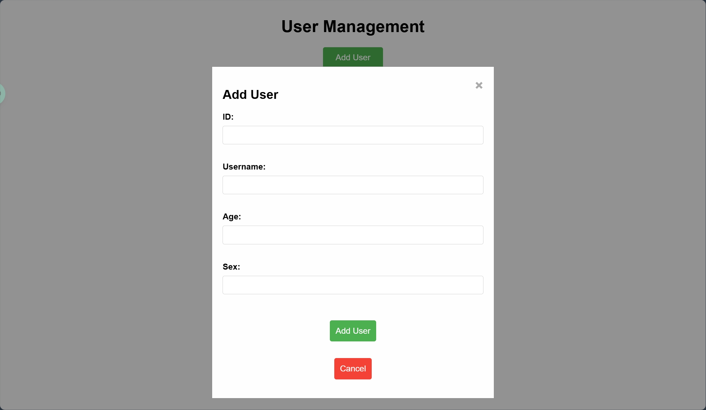

# BUAA StuManager

## 概述

BUAA-StuManager 是一个用于管理学生信息的 Web 应用程序。它允许用户查看、添加、编辑和删除学生记录。该应用程序还支持分页和按 ID
查询用户。

本项目是buaa北航2学分一般专业课《互联网软件新技术（XML和Web）》（1-9周，考核方式：随堂开卷考试+8页综述论文+小程序）的课程作业，要求为使用XML+WebService技术写一个小程序。

GitHub项目地址：https://github.com/oopb/BUAA-StuManager/tree/master

## 功能

- 查看用户列表并分页显示
- 添加新用户
- 编辑现有用户
- 删除用户
- 按 ID 查询用户

## 使用的技术

- HTML，CSS，JavaScript（前端）
- Python（后端）
- SOAP 绑定 XML 通信
- WebService
- SQLite 本地数据库存储

## 安装说明

### 先决条件

- Python 3.10
- Flask

### 安装步骤

1. 克隆仓库：
    ```sh
    git clone https://github.com/oopb/BUAA-StuManager.git
    cd BUAA-StuManager
    ```

2. 安装所需的 Python 包：
    ```sh
    pip install -r requirements.txt
    ```
   > TODO: requirements.txt

3. 运行应用程序：
    ```sh
    python main.py
    ```
   > `main.py`会执行两个子进程，分别是`service.py`（后端）和`app.py`（前端）。

4. 打开您的 Web 浏览器并导航到 `http://localhost:5000`。

## 文件结构

- `client/templates/index.html`：应用程序的主要 HTML 文件。
- `client/static/index_style.css`：用于应用程序样式的 CSS 文件。
- `main.py`：运行 Flask 应用程序的主要 Python 文件。
- `server/service.py`：后端 Python 文件，包含 WebService 服务。
- `client/app.py`：前端 Python 文件，包含 Web 页面。
- `model/model.py`：定义用户模型的 Python 文件。
- `users.db`：SQLite 数据库文件，存储用户信息。
- ~~`requirements.txt`：包含项目所需 Python 包的文件。~~

## 使用方法

- **查看用户**：点击`Get User List`按钮查看默认初始页面的用户列表。
- **添加用户**：点击`Add User`按钮导航到添加用户页面。
- **编辑用户**：点击用户旁边的`Edit`按钮编辑用户信息。
- **删除用户**：点击用户旁边的`Delete`按钮删除用户记录。
- **按 ID 查询用户**：在查询表单中输入用户 ID 并点击`Query User`按钮搜索特定用户。

## 界面展示


<p align="center">Figure 1: 主界面</p>


<p align="center">Figure 2: 编辑用户</p>



<p align="center">Figure 3: 添加新用户</p>


<p align="center">Figure 4: 无法添加已存在id的用户</p>

## XML 展示

```xml
<?xml version='1.0' encoding='UTF-8'?>
<soap11env:Envelope xmlns:soap11env="http://schemas.xmlsoap.org/soap/envelope/" xmlns:tns="PyWebService2">
    <soap11env:Body>
        <tns:add_userResponse>
            <tns:add_userResult>{"id": 26, "user_name": "k", "age": 26, "sex": 26}</tns:add_userResult>
        </tns:add_userResponse>
    </soap11env:Body>
</soap11env:Envelope>
```

```xml
<?xml version='1.0' encoding='UTF-8'?>
<soap11env:Envelope xmlns:soap11env="http://schemas.xmlsoap.org/soap/envelope/" xmlns:tns="PyWebService2">
    <soap11env:Body>
        <tns:add_userResponse>
            <tns:add_userResult>{"error": "id already exists"}</tns:add_userResult>
        </tns:add_userResponse>
    </soap11env:Body>
</soap11env:Envelope>
```

上方的xml表示两次添加用户的返回结果，其中第一次添加成功，第二次添加失败。

## 作者

- 22230610 曹晨旭
